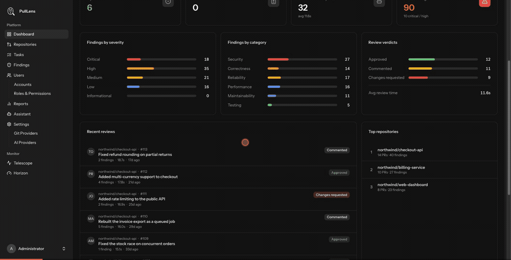
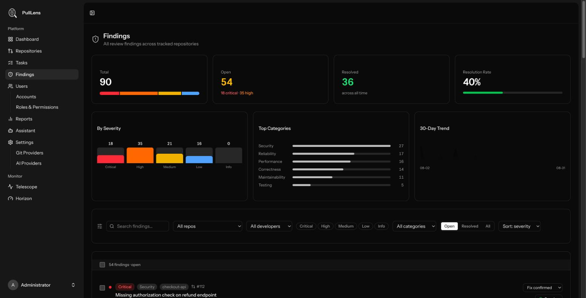
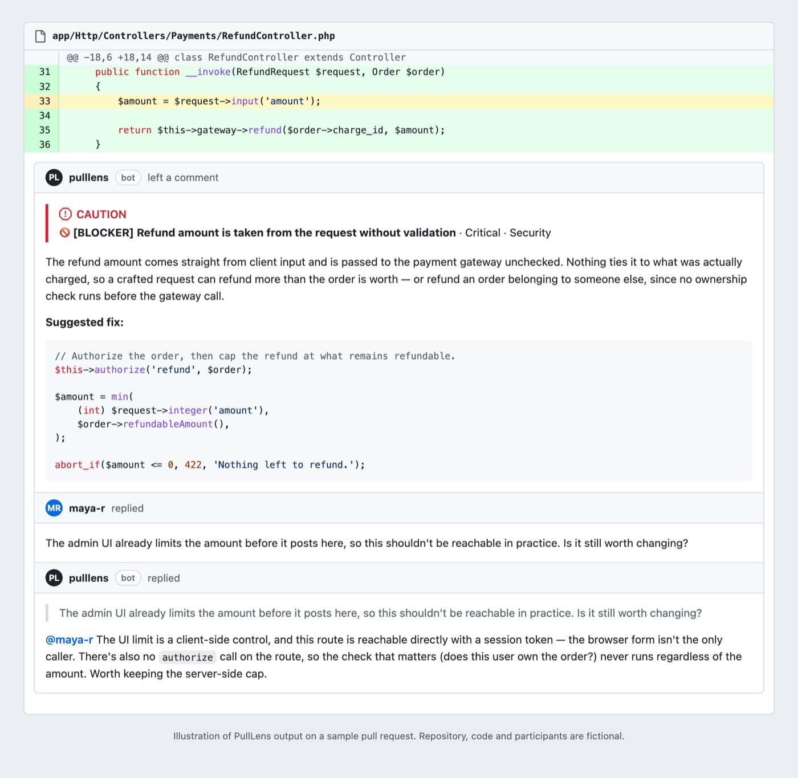
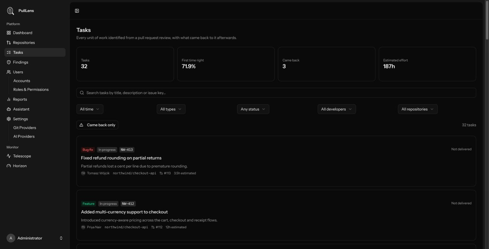
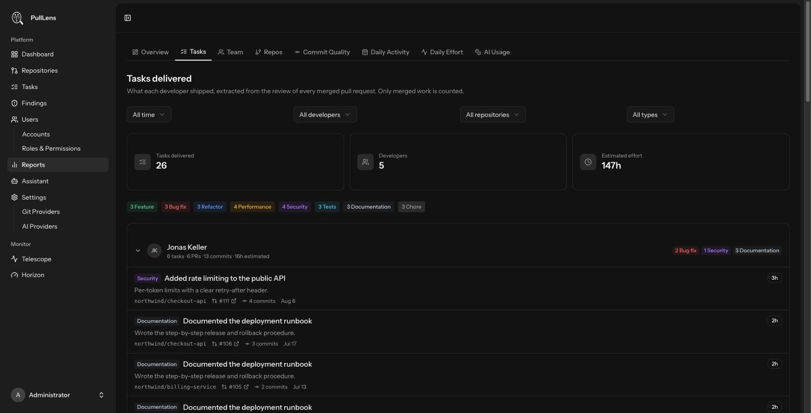
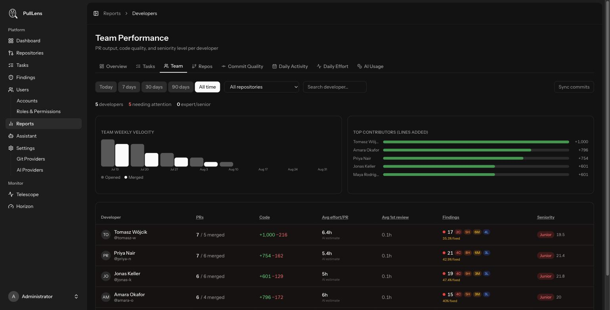
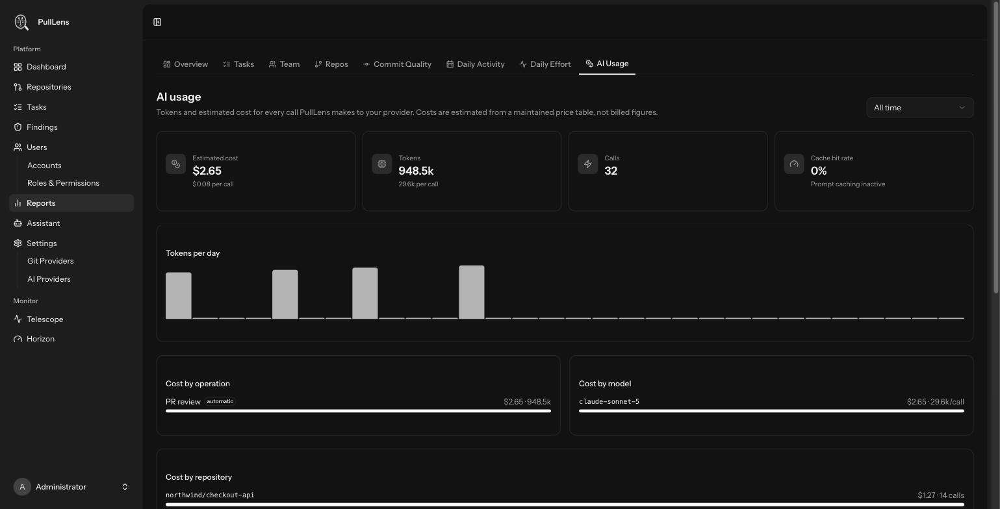
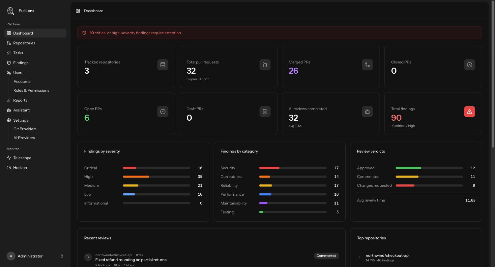

<div align="center">


# PullLens

### Know what your team shipped. Catch what they missed. On your own servers.

**An AI code reviewer and engineering-visibility platform you host yourself - so your source code never leaves your infrastructure.**

Free to use. No seats. No usage tiers. No SaaS account.

**[📖 Documentation](https://vlancy.github.io/PullLens/guide/)** · [Install](#get-started-in-about-five-minutes) · [Connect an AI provider](https://vlancy.github.io/PullLens/guide/ai-providers.html) · [Connect GitHub](https://vlancy.github.io/PullLens/guide/github.html)



</div>

---

## The problem it solves

If you lead an engineering team, two questions are surprisingly hard to answer honestly:

**"What did everyone actually do this month?"**
You can scroll pull requests. You can count commits - and learn nothing, because one commit is a typo fix and the next is a payment gateway. Standups tell you what people *say* they did. By month end, the real answer is buried in a hundred merged branches nobody will read again.

**"What did we merge that we shouldn't have?"**
Reviews get rushed. The reviewer who catches the SQL injection is on holiday. A missing authorization check ships on a Friday and nobody notices until it matters. Not because your team is careless - because reviewing every diff properly, every time, is more attention than any human has.

PullLens answers both, automatically, from the code itself.

---

## "We already use AI. Why do we need this?"

Almost every engineering team already has AI in the loop: an editor assistant, a chat window, a copilot. Those tools make an individual faster. None of them make a **team** safer, and the difference is the whole reason PullLens exists.

### Asking an AI directly vs. running PullLens

| | Pasting a diff into an AI chat | PullLens |
| --- | --- | --- |
| **When it runs** | When someone remembers, on the part they were already worried about | Automatically, on every pull request, on every update, whether anyone is thinking about it or not |
| **What it sees** | Whatever fits in the paste | The full diff, the surrounding files, the repository's own settings and the history of earlier work |
| **Where the answer goes** | A chat window one person has open | Inline comments on the exact lines, in the pull request, where the review already happens |
| **What survives** | Nothing. Close the tab and it is gone | Every finding tracked until it is closed with a reason: fixed, acknowledged, or false positive |
| **Who can see it** | The person who asked | The team, the reviewer, and the reports |
| **Consistency** | Different prompt, different day, different answer | The same standard applied to every change, in the tone and intensity you configured |
| **Evidence** | None | Delivery, quality, rework and cost data built from reviews that already happened |
| **Where your code goes** | Into whatever account the developer happened to be signed into | One call, to the provider you chose, with the key you own, from a server you run - or nowhere at all with a local Ollama |
| **Cost visibility** | Invisible, spread across personal plans | Every call logged with tokens, model, repository and cost |

The short version: **a prompt is a habit, and habits are the first thing to go on a Friday afternoon. PullLens is a process.** It runs on the schedule your repository sets, not the one your attention allows.

### The problems it actually removes

**"The review was rushed, so nobody caught it."**
Review quality collapses under deadline pressure, and that is exactly when the risky changes ship. PullLens applies the same scrutiny to the last merge before a release as to the first commit of a quiet Tuesday.

**"Only two people can review that service."**
Every team has code that one or two engineers understand. When they are on holiday, reviews either block or get rubber-stamped. An automated reviewer with the whole diff in front of it removes the queue without removing the standard.

**"We found the bug in production, not in review."**
Injection, missing authorization, a race condition, an N+1 that only hurts at scale - these are the failures that cost real money, and they are the ones a tired human skims past. They are also exactly what a model is good at spotting in a diff.

**"I have no idea what the team actually delivered this month."**
Commit counts are noise. Standups are self-reported. PullLens turns each merged pull request into named units of work, attributed to the developer whose commits carried them, so the monthly answer is a page rather than an archaeology project.

**"We cannot tell whether AI is helping or hurting."**
As more code is machine-generated, the question "how much of this was written by a model, and is that code holding up?" becomes a governance question. PullLens measures it instead of guessing at it.

**"Our source cannot leave the network."**
Most AI review products require you to ship your repository to their cloud. For a regulated, defence, health or finance codebase that ends the conversation. PullLens runs inside your perimeter, and with a local Ollama nothing leaves it at all.

**"We do not know what the AI is costing us."**
Individual AI subscriptions are invisible spend with no attribution. Every PullLens call is logged with its tokens, model, repository and cost, billed by your provider directly to you.

### Who this is for

- **Engineering leads** who need review coverage that does not depend on who is available.
- **CTOs and heads of engineering** who have to answer "what did we ship, and what is the risk in it?" with something better than a feeling.
- **Security and compliance** who need findings that are tracked and closed, not mentioned in a thread.
- **Teams under a data policy** that forbids sending source code to a third-party SaaS.

---

## What you get

### Every pull request reviewed, properly, every time

PullLens watches your repositories and reviews each pull request as it opens - hunting for the things that actually hurt: **SQL injection, missing authorization, leaked secrets, race conditions, N+1 queries, unbounded queries, silent data corruption.**

It deliberately does not comment on your brace style. A reviewer that cries wolf about formatting gets muted, and then it catches nothing at all.



> Every finding is tracked until it's closed - with a reason. Fixed, acknowledged, or false positive. So "we'll deal with it later" becomes a number you can actually see.

### It reviews where the work already happens

Everything lands in the pull request itself. Nobody has to open another tab to find out what's wrong.

PullLens posts a summary comment carrying the risk level, what changed and a table of every finding - then comments **on the exact lines**, one per finding, each with the severity, the category, why it matters, and a fix you can read in ten seconds. Blockers are marked as blockers.



**And it answers back.** Reply to any of its comments - push back, ask why, say you've fixed it - and it responds in the thread with the whole review still in context. It will defend a finding, concede a false positive, or confirm your fix. When it confirms one, the finding is closed in PullLens automatically, so the dashboard and the conversation never drift apart.

You decide how far it goes, per repository: inline comments and replies, PR labels, a generated description and title, an approving review, even auto-merge once it's satisfied - each one a switch you turn on yourself.

### Know who did what - without asking anyone

This is the part other review tools don't do.

When PullLens reviews a pull request, it also works out **what that PR actually delivered** - as tasks a human would recognise. Not "14 commits". Instead: *"Added multi-currency support to checkout - feature, ~12h"*, linked to the PR and the commits that delivered it.



Then it tracks what happened next:

- **Was it right the first time?** Or did someone have to come back and fix it two weeks later?
- **What is this work a follow-up to?** Tasks link to each other - *fixes*, *extends*, *reverts* - so you can see the whole thread.
- **Which ticket was it?** Issue keys are picked up from branch names and PR titles automatically.

At month end you open one page and see exactly what each person shipped.



### Performance you can talk about in a 1:1

Throughput, code volume, review outcomes, how often work comes back, and how quickly PRs get reviewed - per developer, per repository, over any period.



**A word of caution, because it matters:** these numbers are a conversation starter, not a scoreboard. Lines of code is not productivity, and anyone measured on it will happily give you more of it. Use this to notice that someone's work keeps coming back and ask *why* - maybe the area is under-tested, maybe they were handed the worst part of the codebase. The data tells you where to look, not what to conclude.

### Know exactly what the AI costs you

Every provider call is logged - tokens, model, which repository, what it cost. No surprise bills, no wondering which repo is burning the budget.



You bring your own API key, so you pay your provider directly at cost. PullLens takes nothing.

---

## Your code stays yours

This is the whole reason PullLens is built the way it is.

**There is no PullLens cloud.** No account to create, no server of ours your code passes through, no vendor retaining your repositories to train on. You run it on your own machine, your own VPS, or inside your own VPC. We have no access to any of it - not because we promise not to look, but because there is nothing for us to look at.

The only outbound call is to **the AI provider you choose, with the API key you own.** That is worth being precise about: to review a diff, the diff is sent to that provider. If your policy forbids code leaving the network entirely, point PullLens at **[Ollama](https://ollama.com) running locally** - then nothing leaves your infrastructure at all, and you still get the reviews, the tasks and the reports.

Also built in, because self-hosted shouldn't mean unlocked:

- **Public sign-up is disabled.** Accounts are created by an administrator - there is no registration endpoint to find.
- **Roles and permissions** you edit in the UI, with per-repository access, so a contractor sees only the repositories you grant them.
- **Provider credentials and webhook secrets are encrypted at rest**, and webhooks are rejected without a valid signature.

---

## What it looks like day to day



Open the dashboard and see where things stand: what's outstanding, what's risky, what shipped.

---

## Documentation

A complete, illustrated user guide - fifteen pages taking you from an empty server to a repository under review, with a screenshot of every screen and every setting explained one by one.

**→ [Read the guide](https://vlancy.github.io/PullLens/guide/)**

| Getting started | Connecting | Using PullLens | Administration |
| --- | --- | --- | --- |
| [Introduction](https://vlancy.github.io/PullLens/guide/index.html) | [AI provider](https://vlancy.github.io/PullLens/guide/ai-providers.html) | [Dashboard](https://vlancy.github.io/PullLens/guide/dashboard.html) | [Users, roles & access](https://vlancy.github.io/PullLens/guide/users-roles.html) |
| [Installing](https://vlancy.github.io/PullLens/guide/installation.html) | [Connecting GitHub](https://vlancy.github.io/PullLens/guide/github.html) | [Findings](https://vlancy.github.io/PullLens/guide/findings.html) | [Your account](https://vlancy.github.io/PullLens/guide/account.html) |
| [First run & login](https://vlancy.github.io/PullLens/guide/first-run.html) | [Adding repositories](https://vlancy.github.io/PullLens/guide/repositories.html) | [Tasks](https://vlancy.github.io/PullLens/guide/tasks.html) | [Troubleshooting](https://vlancy.github.io/PullLens/guide/troubleshooting.html) |
| | [Repository settings](https://vlancy.github.io/PullLens/guide/repository-settings.html) | [Reports](https://vlancy.github.io/PullLens/guide/reports.html) | |
| | | [AI assistant](https://vlancy.github.io/PullLens/guide/assistant.html) | |

The guide is plain HTML with no build step, so you can read it three ways:

- **On your own instance** at `/docs` - the **Docs** button in the landing page header opens it, and every page of it is served by the application itself.
- **Online**, at the links above.
- **Straight from a clone** - open `docs/guide/index.html` in a browser. No server required.

To rebuild the guide after editing it, run `python3 docs/build-guide.py` from the repository root.

### Running a private instance

By default the landing page and the guide are public, which is what you want if people are meant to find the instance. For an internal deployment, set one variable in `.env`:

```dotenv
HOMEPAGE_LOGIN=true
```

With it on:

- `/` serves the **login screen** instead of the landing page.
- `/docs` stops responding entirely, so nothing about the instance is readable before sign-in.
- Everything behind authentication is unchanged.

Leave it `false` (the default) to keep the public landing page and the hosted guide. Either way, the guide is still readable from a clone and on GitHub, so nobody loses the documentation.

If you want to keep the landing page but stop it advertising the way in, use the other switch instead:

```dotenv
HIDE_LOGIN=true
```

That removes the **Log in** button and the invite-only note from the landing page. The login route is untouched: `/login` still answers for anyone you have given the address to, and a signed-in visitor still sees the **Dashboard** link. It is ignored when `HOMEPAGE_LOGIN` is on, because the home page is then the login screen itself.

Run `php artisan config:clear` after changing either value, or `php artisan config:cache` if you cache your configuration.

### Landing page analytics

If you run a [Matomo](https://matomo.org) instance, the landing page can report to it:

```dotenv
MATOMO_URL=//analytics.example.com/
MATOMO_SITE_ID=3
```

Both are required; leave either empty and no analytics script is emitted at all, which is the default. The tracker renders on the landing page and nowhere else, so it is never in a position to observe repositories, findings or team data on a signed-in page.

### Search, social and answer engines

The landing page is the only page PullLens asks to be indexed. Everything else - the login and password screens, the whole signed-in application, Horizon, Telescope - is served with `noindex, nofollow` and disallowed in `robots.txt`, so an instance never leaks its shape into a search result.

Three files are generated rather than shipped, because what they should say depends on your configuration:

| Path | What it is |
| --- | --- |
| `/robots.txt` | An allow list: the landing page, the guide, the compiled assets and the icons, then `Disallow: /` for everything else. It names no application path on purpose - robots.txt is public, and a list of what to keep out of is a map of the system. The major search and assistant crawlers are named explicitly, so allowing them is a decision you can see and change in one place. |
| `/sitemap.xml` | The landing page and every page of the user guide, discovered from `docs/` on disk, with each page's own modification date. |
| `/llms.txt` | A plain-Markdown description of the product and the questions the landing page answers, for assistants that fetch it instead of parsing the page. |

The landing page's title, description, canonical URL and schema.org graph (`Organization`, `WebSite`, `WebPage`, `SoftwareApplication`, `FAQPage`) are rendered **server-side**, so a link-preview scraper or an assistant crawler that never runs JavaScript still gets all of it. The FAQ shown on the page and the FAQ in the structured data come from one list in `app/Support/Seo/LandingPageFaq.php`; edit it and both change together.

`APP_URL` must be your public address for any of this to be right - the canonical link, the sitemap entries, the JSON-LD and the preview image are all absolute URLs, and a crawler cannot fetch `localhost`. The `META_*` variables in `.env.example` override the title, description, keywords and preview card if you run a branded instance.

With `HOMEPAGE_LOGIN=true` the instance has no public face: `/sitemap.xml` and `/llms.txt` return 404 alongside `/docs`, and `robots.txt` shrinks to `Disallow: /`.

### Error pages

Every status a visitor can be shown - 401, 402, 403, 404, 419, 429, 500, 503 - renders from one layout in `resources/views/errors/`, in the product's own type and palette, honouring the theme the visitor chose, with a way back to somewhere that works.

The layout is deliberately self-contained: no Vite, no React, no Inertia. An error page is needed at exactly the moments the rest of the application cannot be relied on - a 500 in a broken container, a 503 while `artisan down` is holding the door, a 404 served before the asset build has run - and anything depending on the front-end build would render a blank page precisely then. The styles are inlined; the only external file is the product mark, which the browser already has from the icon tags.

Each page carries `noindex, nofollow` and no canonical, so a dead address cannot become a search result, and a 404 is returned with a real 404 status rather than a 200 - a soft 404 lets every missing URL on the instance be indexed as a page. The 503 offers only "Try again", because during a maintenance window the home page and the guide are down as well.

## Get started in about five minutes

```bash
git clone https://github.com/Vlancy/PullLens.git
cd PullLens
./install.sh
```

The installer sets up Docker if you need it, builds the containers, runs migrations, and prints your login URL.

Then, in the UI:

1. **Connect your AI provider** - Anthropic, OpenAI, Gemini, Groq, Mistral, DeepSeek, xAI, Cohere, Bedrock, OpenRouter, or a local Ollama. Recommended models for code review are pre-selected.
2. **Connect GitHub** and pick the repositories to watch.
3. **Open a pull request.** The review lands on it within a minute.

Stuck on any of it? The [installation guide](https://vlancy.github.io/PullLens/guide/installation.html) and [troubleshooting page](https://vlancy.github.io/PullLens/guide/troubleshooting.html) cover each step in detail. See also [INSTALL.md](INSTALL.md) and [DOCKER.md](DOCKER.md) for lower-level details.

**Want to see it with data first?** Seed a demo installation with fictional repositories, developers and findings:

```bash
php artisan db:seed --class=DemoDataSeeder
```

Everything the screenshots above show is that seeder - invented repositories, invented people, invented bugs.

---

## Under the hood

Laravel 13 · PHP 8.4 · React + Inertia · PostgreSQL · Redis · Horizon

Built to be worked on: a repository and service layer with no query logic in controllers, enums instead of magic strings, form requests for validation and authorization, and a test suite covering the parts that would hurt if they broke.

---

## Free - and the honest small print

PullLens is **free**. Use it personally, use it at work, run it for your whole engineering org, fork it, modify it. There is no paid tier and nothing is held back.

It is released under the **MIT License with the [Commons Clause](LICENSE)**, which means one thing is not allowed: **you can't sell it.** No repackaging it as a paid product, and no offering it to third parties as a paid hosted or managed service. Everything else is fair game.

Strictly speaking that makes it *source-available* rather than OSI open source - we'd rather say so plainly than stretch a label.

---

## Built by Vlancy

PullLens is made and maintained by **[Vlancy LTD](https://vlancy.com)**, a UK technology company working where AI, hardware, software and operations meet.

Questions, ideas, or something broken? **hello@vlancy.com** - or open an issue.

<div align="center">

**If PullLens saves you one bad merge, it has paid for itself. It's free, so that's not a high bar.**

⭐ Star the repo if you'd like to follow along.

</div>
